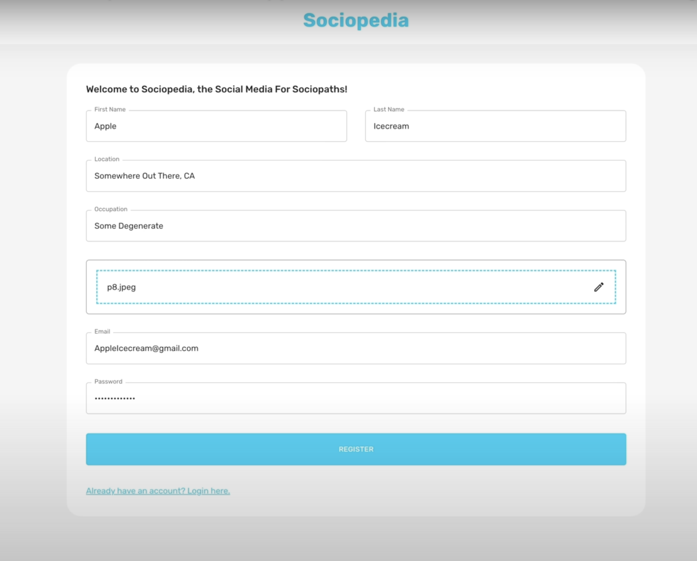

# Social Media Platform

Welcome to the Social Media Platform project! This platform allows users to register, login, write posts, add friends, check friends' posts, and like or comment on posts.

## Features

- **User Registration**: Users can create an account by providing their email and password.

- **User Login**: Registered users can log in with their credentials.

- **Create Posts**: Users can create posts to share their thoughts, photos, or updates.

- **Add Friends**: Users can send friend requests to other users and accept or decline friend requests.

- **View Friends' Posts**: Users can see posts from their friends in their feed.

- **Like and Comment**: Users can like and comment on posts made by their friends.

## Technologies Used

- **Frontend**:
  - React.js: A JavaScript library for building user interfaces.
  - Material-UI: A popular React UI framework for designing attractive and responsive user interfaces.

- **Backend**:
  - Node.js: A JavaScript runtime for building server-side applications.
  - Express.js: A web application framework for Node.js.
  - MongoDB: A NoSQL database for storing and managing data.

## Screenshots
